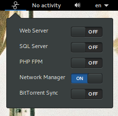

# Services Panel
A Gnome Shell extension to toggle your services from the top panel.

Fork of the [web-dev-panel](https://github.com/mediadoneright/web-dev-panel) extension, which is itself based upon code from [Lamp Status](https://extensions.gnome.org/extension/990/lamp-status/).

### Adding / Removing services from the panel
You can reach the configuration panel from Gnome Tweak Tool or by running `gnome-shell-extension-prefs services-panel@bit-else.com`
